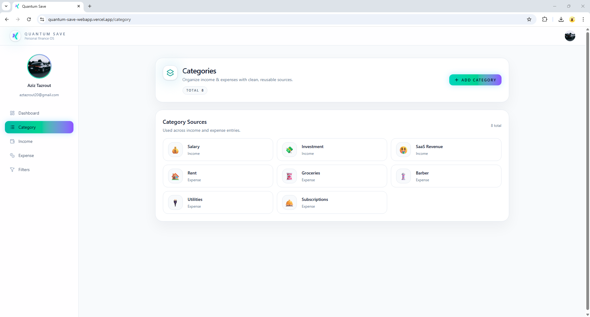
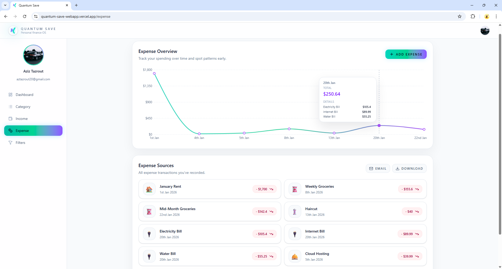
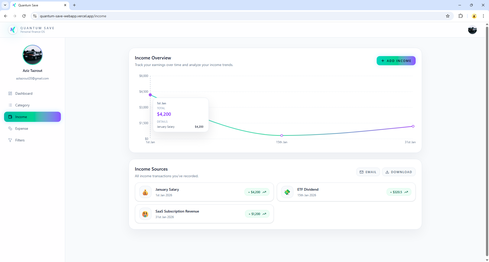
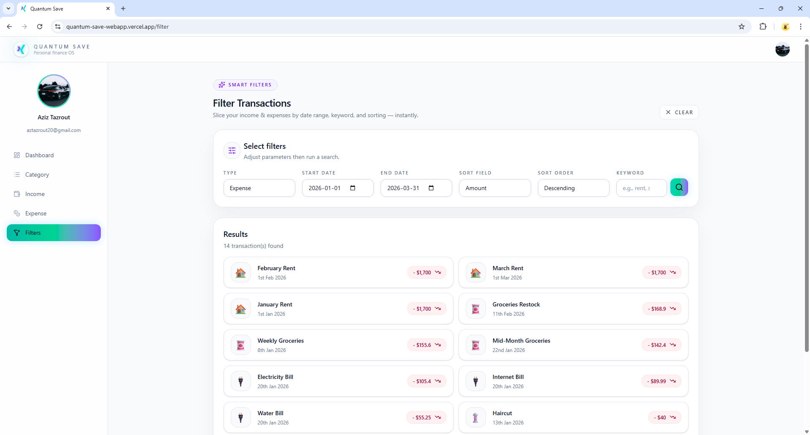
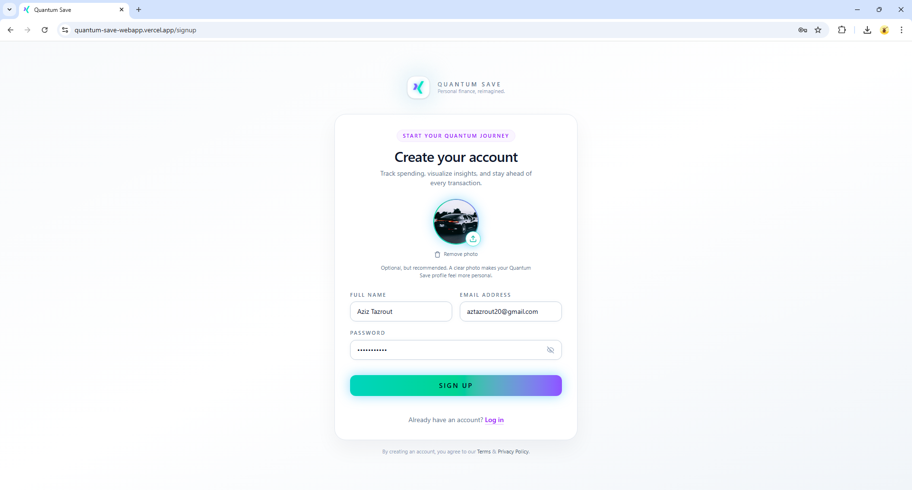

# 💸 Quantum Save — Web App (Frontend)

A production-style personal finance dashboard built with **React + Vite + Tailwind**.  
Track **income**, **expenses**, and **categories** in real time, explore trends with **interactive charts 📊**, and keep the UI consistent across pages through an **auth-aware caching + invalidation strategy**.

🌐 **Live Demo:** https://quantum-save-webapp.vercel.app  
🧠 **Backend API:** https://github.com/azedta/quantum-save (Spring Boot + PostgreSQL)

---

## ✨ Highlights

- 🔐 Auth-aware data fetching (no 401 spam, no infinite refetch loops)
- 🔁 Cross-page consistency with targeted cache invalidation
- ⏱️ Stale-time caching for fast navigation
- 🦴 Skeleton loaders & empty states for smooth UX
- 🔎 Smart Filters for slicing transactions
- 📊 Insight layer with interactive charts

---

## 🖼️ Screenshots

### 📊 Dashboard


### 🗂️ Categories


### 💸 Expenses


### 💰 Income


### 🧠 Smart Filters


### 🔐 Signup


---

## 🚀 Features

### 🧩 Core Product
- 🏠 Dashboard overview
- 💰 Income management (add / list / delete + Excel export)
- 💸 Expense management (add / list / delete + Excel export)
- 🏷️ Categories with emoji icons 😄
- 🧠 Smart Filters (date, keyword, sorting)
- 🔐 Auth flows (login / signup / verify email)
- 👤 Profile photo upload (Cloudinary ☁️)

---

## 🎨 UX & Engineering Highlights

- 🔒 Auth-first request gating
- ⏳ Stale-time caching + targeted invalidation
- 🧪 React 18 StrictMode-safe fetching
- ⚡ Skeleton loaders, modals, toasts
- 📈 Custom Line & Pie charts with rich tooltips

---

## 🧰 Tech Stack

- ⚛️ React + Vite
- 🎨 Tailwind CSS
- 🧭 React Router
- 🔌 Axios
- 📊 Recharts
- 🔔 react-hot-toast
- 🧩 Lucide Icons
- ☁️ Cloudinary

---

## 🗂️ Project Structure

```txt
src/
  assets/
  components/
  context/
  hooks/
  pages/
  util/
```

---

## 🔌 API Integration

- JWT injected via Axios interceptor
- Public endpoints excluded from auth
- Logout handled centrally in `useUser()`

---

## 🔐 Environment Variables

```bash
VITE_API_BASE_URL=http://localhost:8080/api/v1.0
```

---

## ▶️ Run Locally

```bash
npm install
npm run dev
```

---

## 🚢 Build & Deploy

```bash
npm run build
npm run preview
```

Deployed on **Vercel** 🚀

---

### 📄 License

This project is proprietary and protected under an All Rights Reserved license.

The source code is provided for viewing and evaluation purposes only as part of a personal portfolio. Any use, reproduction, modification, or distribution without explicit permission from the author is prohibited.
